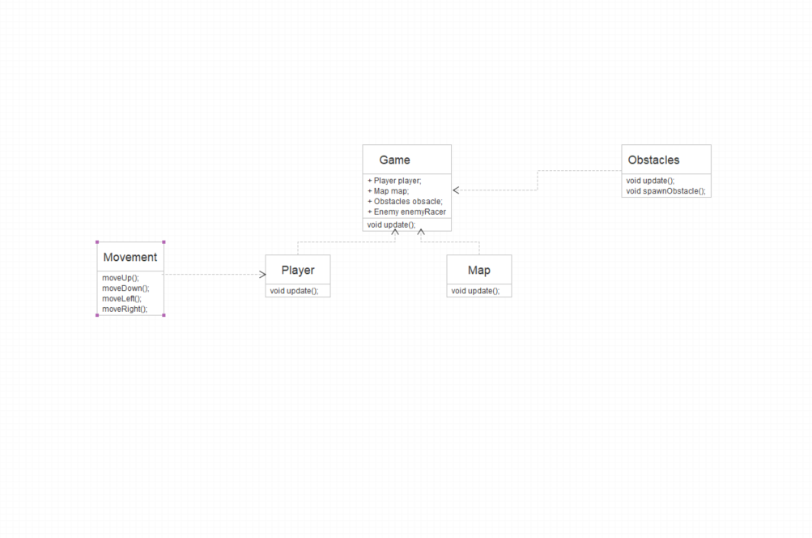

# SneakyRace
***
## Idea
Our idea for the Threading in C# course is to build a fully functional 2D game in Unity with the purpose of showing the functionality of threads in an efficient way. 

## Description of the game
Sneaky Race will be a 2 players game in which both players play against each other on a two-dimensional map starting from a specify chosen point. The cars will run continuously controlled by W, A, S, D for Player 1, and the arrows keys for Player 2. Each snake will leave a trail behind, in this way the trail of the car will slowly increase and decrease after a certain time, and the main purpose of the game is to survive as long as possible. If one car intersects the trail left by the other care or even his own trail he loses and the game ends. The players have the option to choose his own color for the car in the beginning of the game. On the map there will be spawn different obstacles for the purpose of making the game harder. This obstacle will appear randomly on the map during the game. These obstacles will remain on the map for the hole duration of the game. If one player hits one of the obstacles he loses, and the game is won by his opponent. The map will have boundaries which are determined by the size and if one car reach or hits this boundary he loses. 
We will have a UI for the main menu from which the game can be started, and the colors of the cars can be chosen. Instructions of the game are also shown here as well as with an option to quit the game.

## How threads will be used

#### Lock Thread 
  In our game there will be a countdown from the moment you press Start game until the game actually begins. A single thread will handle this countdown and will let the game start after the countdown reaches 0. It will be a locking thread. If another thread tries to enter into critical section of code, then it is prevented and blocked and then it will wait until the chosen task is released from the using thread.
#### ThreadPool 
  During the game, different objects will be spawn on the map on a specific interval of time. We will create a system threading time that defines the callback method, and the amount of time to delay before the first invocation of the callback and the time interval between callbacks invocations.

## UML

